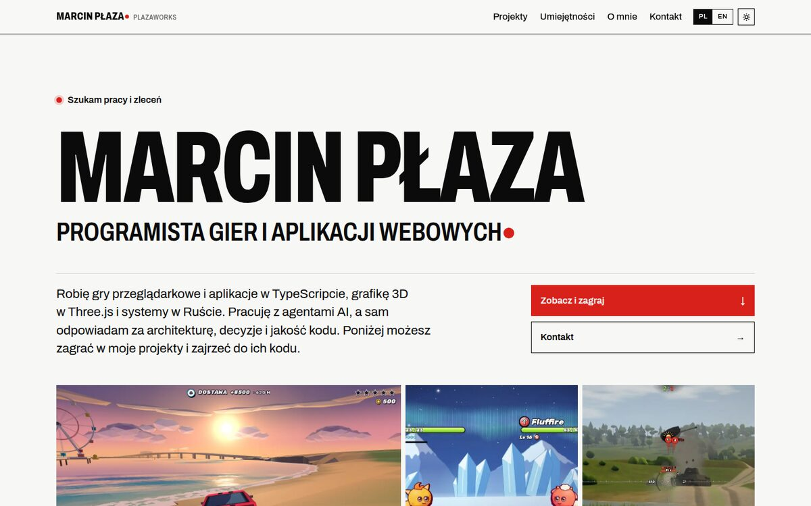

# PlazaWorks

Portfolio **Marcina Płazy** (PlazaWorks): gry przeglądarkowe, Three.js, TypeScript, Rust
i praca z agentami AI. Styl: szwajcarski „Indeks” (makieta C z `mockups/`).



Statyczna strona bez frameworka i bez zależności: `index.html`, `assets/site.css`,
`assets/site.js`, lokalny font Archivo i zrzuty z gier. Bez ciasteczek, trackerów i zewnętrznych
zapytań.

## Funkcje

- Dwie wersje językowe, polska i angielska, w jednym pliku HTML. Język wybiera się
  przyciskiem PL/EN, parametrem `?lang=en` albo automatycznie z ustawień przeglądarki.
- Jasny i ciemny motyw (domyślnie systemowy, przełącznik w nagłówku).
- Układ responsywny, od telefonu po szeroki monitor.
- Polska typografia: jednoliterowe spójniki nie zostają na końcu wiersza.

## Podgląd lokalny

```bash
python -m http.server 8080
```

Potem otwórz <http://localhost:8080/>.

## Publikacja na GitHub Pages

1. Zmerguj zmiany do `main`.
2. W repozytorium: **Settings → Pages → Build and deployment → Source: Deploy from a branch**,
   gałąź `main`, katalog `/ (root)`.
3. Strona będzie pod adresem `https://forgemarcineksiema-art.github.io/plazaworks/`.
   Własną domenę ustawisz w tym samym miejscu (pole **Custom domain**).

## Edycja

| Co | Gdzie |
|---|---|
| Teksty (PL i EN obok siebie) | `index.html`, elementy z `lang="pl"` / `lang="en"` |
| Linki „Zagraj” | `index.html`, atrybut `href` w linkach `class="play"` (pusty = ukryty) |
| E-mail kontaktowy | `assets/site.js`, stała `CONTACT_EMAIL` (pusty = ukryty) |
| Inne style (makiety) | `mockups/index.html` |
| Kolory, fonty, układ | `assets/site.css`, tokeny w bloku `:root` |
| Zrzuty z gier | `assets/img/` (WebP, 1280 px szerokości) |
| Obraz do udostępniania (Open Graph) | `assets/img/og.jpg` (1200×630) |

## Licencje

Kod strony i obrazy z gier: © Marcin Płaza. Fonty: SIL Open Font License 1.1,
szczegóły w [`assets/fonts/LICENSE.md`](assets/fonts/LICENSE.md).
